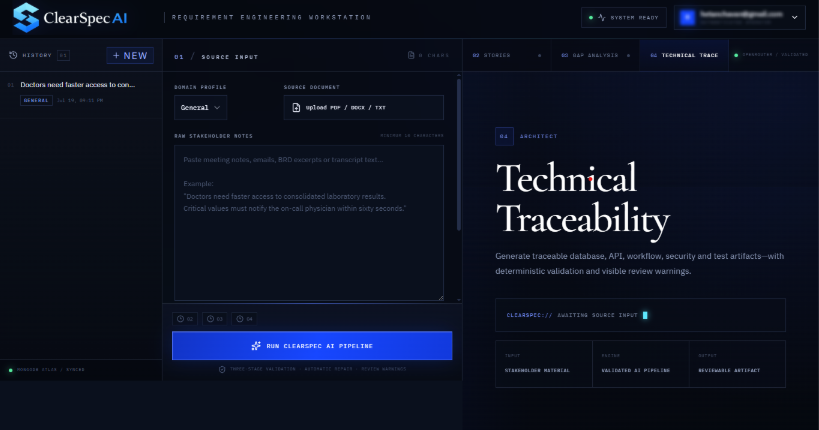
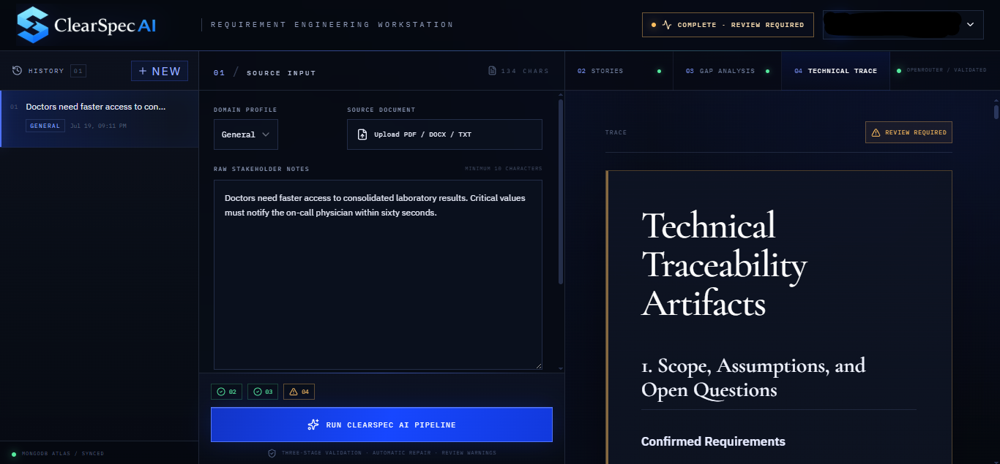

# ClearSpec AI

[](https://github.com/hetanchavan-ship-it/ClearSpecAI/actions/workflows/ci.yml)

**AI-powered requirements engineering workstation for transforming uncertain stakeholder input into reviewable software requirements and technical traceability artifacts.**

## Live Application

- **Frontend:** [https://clearspec-ai-frontend.onrender.com](https://clearspec-ai-frontend.onrender.com)
- **Backend API documentation:** [https://clearspec-ai-backend.onrender.com/docs](https://clearspec-ai-backend.onrender.com/docs)

> The hosted backend uses a free-tier service and may require additional startup time after inactivity.

---

## Overview

ClearSpec AI helps business analysts, product teams, and software engineers convert unstructured stakeholder material into structured implementation artifacts.

Users can paste raw notes or upload supported documents. The application then executes a three-stage AI pipeline:

1. **Standardised User Stories**
2. **Gap and Conflict Analysis**
3. **Technical Traceability**

Each stage is checked using deterministic validation rules. When output fails validation, ClearSpec AI can automatically request a corrected response. Remaining architectural concerns are displayed as visible review items instead of being silently ignored.

---

## Application Screenshots

### Landing Page

[Open the complete ClearSpec AI landing-page screenshot](docs/screenshots/landing-page.png)

### Requirements Engineering Workstation



### Technical Traceability Output



---

## Core Features

### Requirement normalisation

- Converts raw stakeholder notes into structured Agile user stories
- Uses the standard format:

  ```text
  As a...
  I want...
  So that...
  ```

- Generates measurable acceptance criteria
- Identifies assumptions and open questions
- Assigns priority and implementation estimates

### Gap and conflict analysis

- Detects ambiguous or undefined terminology
- Identifies contradictions and feasibility risks
- Lists missing functional requirements
- Lists missing edge cases
- Reviews security, privacy, and compliance concerns
- Identifies missing non-functional requirements
- Produces stakeholder questions
- Assigns an overall implementation risk score

### Technical traceability

- Maps user stories to technical artifacts
- Produces domain-model proposals
- Generates PostgreSQL schema suggestions
- Defines REST API contracts
- Provides representative request and response payloads
- Generates core-logic pseudocode
- Proposes background jobs and event processing
- Recommends security and reliability controls
- Produces implementation and testing sequences
- Identifies unresolved technical decisions

### Validation and automatic repair

- Deterministic validation for all three pipeline stages
- Automatic correction requests for invalid AI output
- Semantic validation of Technical Trace artifacts
- Visible review warnings for unresolved architecture concerns
- Configurable validation and repair behaviour

### Authentication and history

- Account registration and sign-in
- JWT-based authentication
- User-specific requirement history
- MongoDB Atlas persistence
- Previous pipeline results can be reopened or deleted

### File input

The application supports extracting stakeholder content from:

- PDF
- DOCX
- TXT
- Markdown

---

## Application Architecture

```text
┌──────────────────────────────┐
│        React Frontend        │
│ Landing, Auth, Workstation   │
└──────────────┬───────────────┘
               │ HTTPS / REST
               ▼
┌──────────────────────────────┐
│       FastAPI Backend        │
│ Auth, extraction, pipeline   │
│ validation and history       │
└───────┬──────────────┬───────┘
        │              │
        ▼              ▼
┌───────────────┐  ┌─────────────────┐
│ MongoDB Atlas │  │ OpenRouter API  │
│ Users/history │  │ AI inference    │
└───────────────┘  └─────────────────┘
```

---

## Technology Stack

### Frontend

- React
- JavaScript
- Axios
- React Router
- Tailwind CSS
- Custom responsive CSS
- Cormorant Garamond
- IBM Plex Sans
- IBM Plex Mono

### Backend

- Python
- FastAPI
- Uvicorn
- Pydantic
- Motor
- MongoDB Atlas
- OpenAI-compatible Python SDK
- PyPDF2
- python-docx
- JWT authentication

### Infrastructure

- Render Web Service
- Render Static Site
- MongoDB Atlas
- OpenRouter
- GitHub

---

## Repository Structure

```text
ClearSpecAI/
├── app/
│   ├── backend/
│   │   ├── auth.py
│   │   ├── file_extract.py
│   │   ├── llm_client.py
│   │   ├── output_validator.py
│   │   ├── prompts.py
│   │   ├── server.py
│   │   ├── trace_semantic_validator.py
│   │   └── requirements.txt
│   │
│   └── frontend/
│       ├── public/
│       ├── src/
│       │   ├── assets/
│       │   ├── components/
│       │   ├── lib/
│       │   ├── pages/
│       │   └── styles/
│       ├── package.json
│       └── yarn.lock
│
├── .gitignore
└── README.md
```

---

## Local Development

### Prerequisites

Install:

- Python 3.11 or later
- Node.js
- npm or Yarn
- Git
- MongoDB Atlas account
- OpenRouter API key

---

## Backend Setup

Open PowerShell:

```powershell
cd C:\Users\HP\OneDrive\Desktop\ClearSpecAI\app\backend
```

Create a virtual environment:

```powershell
python -m venv .venv
```

Activate it:

```powershell
Set-ExecutionPolicy -Scope Process -ExecutionPolicy RemoteSigned
.\.venv\Scripts\Activate.ps1
```

Install dependencies:

```powershell
pip install -r requirements.txt
```

Create:

```text
app/backend/.env
```

Add the required backend configuration:

```env
MONGO_URL="your-mongodb-atlas-connection-string"
DB_NAME="clearspec_ai"

CORS_ORIGINS="http://localhost:3000"

OPENROUTER_API_KEY="your-openrouter-api-key"
OPENROUTER_MODEL="tencent/hy3:free"
OPENROUTER_MAX_TOKENS=5000
OPENROUTER_MAX_ATTEMPTS=3
OPENROUTER_TIMEOUT_SECONDS=240

OUTPUT_REPAIR_ATTEMPTS=2
TRACE_ALLOW_REVIEW_WARNINGS=true

JWT_SECRET="replace-with-a-long-random-secret"
JWT_ALGORITHM="HS256"
JWT_EXP_DAYS=7
```

Start the backend:

```powershell
python -m uvicorn server:app --reload --host 127.0.0.1 --port 8000
```

Local API documentation:

```text
http://127.0.0.1:8000/docs
```

---

## Frontend Setup

Open a second PowerShell terminal:

```powershell
cd C:\Users\HP\OneDrive\Desktop\ClearSpecAI\app\frontend
```

Install dependencies:

```powershell
npm.cmd install --legacy-peer-deps
```

Start the frontend:

```powershell
npm.cmd start
```

Open:

```text
http://localhost:3000
```

For local development, the frontend uses its configured development proxy to communicate with the FastAPI backend.

---

## Frontend Environment Variables

For a separately hosted frontend, configure:

```env
REACT_APP_BACKEND_URL="https://your-backend-domain.example"
```

Do not append `/api`. The frontend API client adds `/api` automatically.

Optional local development variables:

```env
WDS_SOCKET_PORT=3000
ENABLE_HEALTH_CHECK=false
```

---

## Deployment

### Backend deployment

The backend is deployed as a Render Web Service.

```text
Root Directory:
app/backend

Build Command:
pip install -r requirements.txt

Start Command:
uvicorn server:app --host 0.0.0.0 --port $PORT

Health Check Path:
/docs
```

### Frontend deployment

The frontend is deployed as a Render Static Site.

```text
Root Directory:
app/frontend

Build Command:
yarn install --frozen-lockfile && yarn build

Publish Directory:
build
```

React Router rewrite:

```text
Source: /*
Destination: /index.html
Action: Rewrite
```

Frontend environment variable:

```env
REACT_APP_BACKEND_URL="https://clearspec-ai-backend.onrender.com"
```

Backend CORS configuration:

```env
CORS_ORIGINS="https://clearspec-ai-frontend.onrender.com"
```

MongoDB Atlas must allow the deployed backend service's outbound IP ranges.

---

## API Endpoints

### Authentication

```text
POST /api/auth/register
POST /api/auth/login
GET  /api/auth/me
```

### Requirements pipeline

```text
POST /api/clean
POST /api/analyze
POST /api/trace
```

### History

```text
GET    /api/history
GET    /api/history/{history_id}
DELETE /api/history/{history_id}
```

### File extraction

```text
POST /api/extract
```

---

## Security Notes

- Never commit `.env` files.
- Never expose the OpenRouter API key in frontend code.
- Keep the JWT secret long, random, and private.
- Restrict MongoDB Atlas network access to trusted addresses.
- Validate uploaded file type and size before processing.
- Treat AI-generated database schemas, APIs, and implementation logic as proposals requiring human review.
- Avoid placing sensitive data in application logs.
- Rotate credentials immediately if they are accidentally exposed.

---

## AI Output Disclaimer

ClearSpec AI generates requirements and architecture proposals using an AI model.

Generated artifacts may contain:

- assumptions
- incomplete domain knowledge
- unsuitable implementation decisions
- incorrect technical details
- security or compliance gaps

All outputs must be reviewed by qualified stakeholders before implementation.

Examples involving healthcare or other regulated domains are illustrative and do not constitute professional, clinical, legal, or compliance advice.

---

## Free-Tier Limitations

The hosted demonstration depends on free-tier infrastructure and model availability. Users may experience:

- backend cold starts
- slower first requests
- inference rate limits
- variable response time
- model-routing changes
- temporary provider unavailability

The deployment is intended as a project demonstration rather than a production service-level commitment.

---

## Project Status

```text
Version: 1.0.0
Status: Deployed
Pipeline: Operational
Frontend: Live
Backend: Live
Database: MongoDB Atlas
```

---

## Author

Hetan Chavan

ClearSpec AI was developed as an AI-assisted requirements engineering and technical traceability platform.
